# MongoDB Notes
MongoDB is a NoSQL database management system that can manage a humongous amount of data
Unlike relational database Management systems, MongoDB uses a NoSQL format to store and retrieve data.

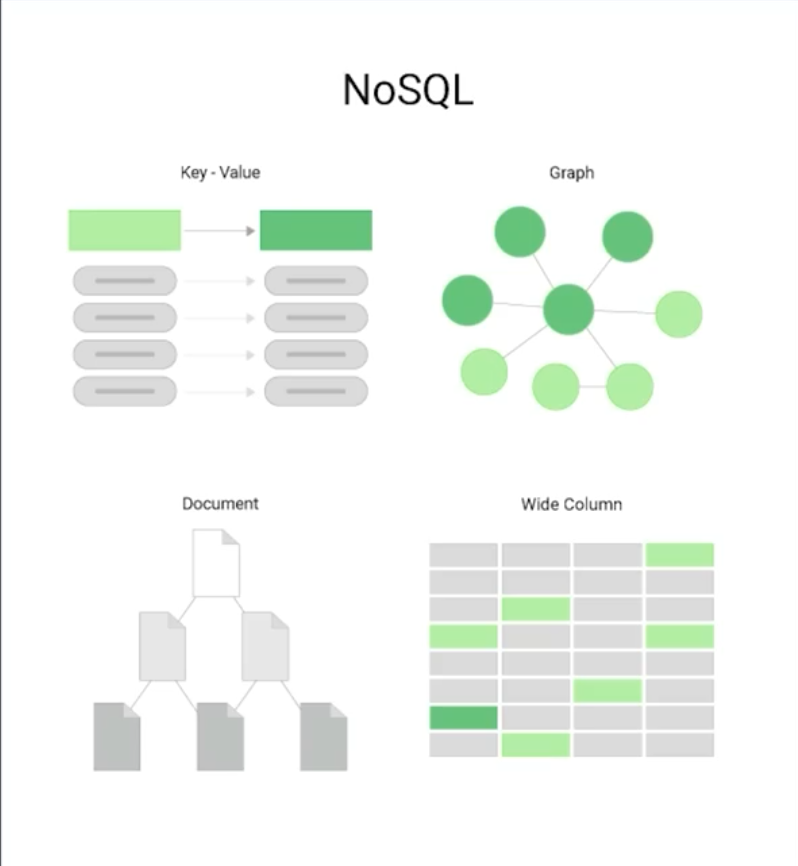

NoSQL means N=Not O=Only S=Structured Q=Query L=Language
It's where data is stored in various formats besides a traditional SQL table

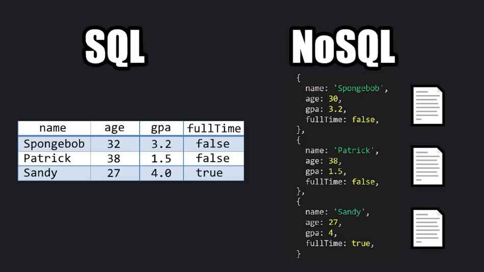

Rather than storing our data in rows and columns with a table using SQL, we store related data as a single document

Think of each document as a single row in a table in SQL
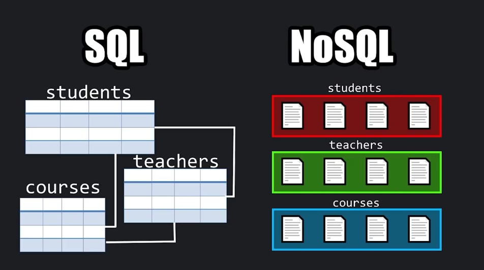

Data in each document is stored as field value-pairs
Similar to a JSON format, but it's technically BSON, Binary JavaScript Object Notation but it behaves very similarly for all intents and purposes
The general idea is that data which is frequently accessed together is stored together, rather than in separate tables because SQL joins are complex
```
{
   name: 'Spongebob',
   age: 30,
   gpa: 3.2,
   fullTime: false, 
}
{
   name: 'Patrick',
   age: 38,
   gpa: 1.5,
   fullTime: false, 
}
{
   name: 'Sandy',
   age: 27,
   gpa: 4,
   fullTime: true, 
}

```

Here is how a NoSQL database is arranged

A document
Is a group of field value-pairs to represent an object
   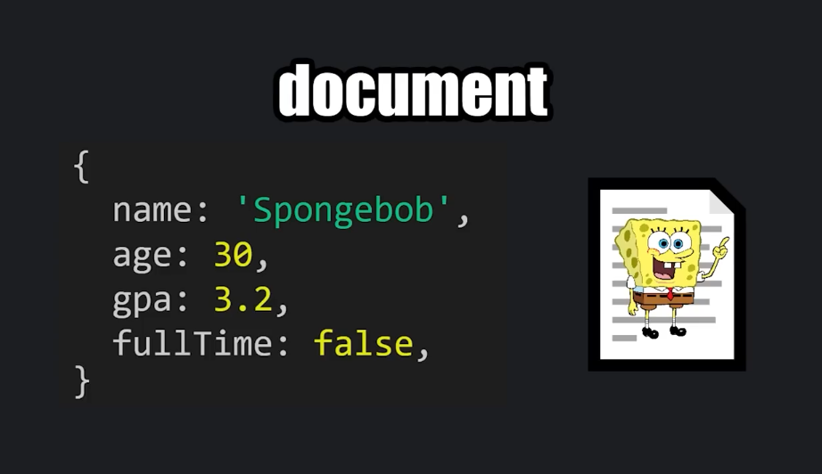

A collection
Is a group of one or more documents
   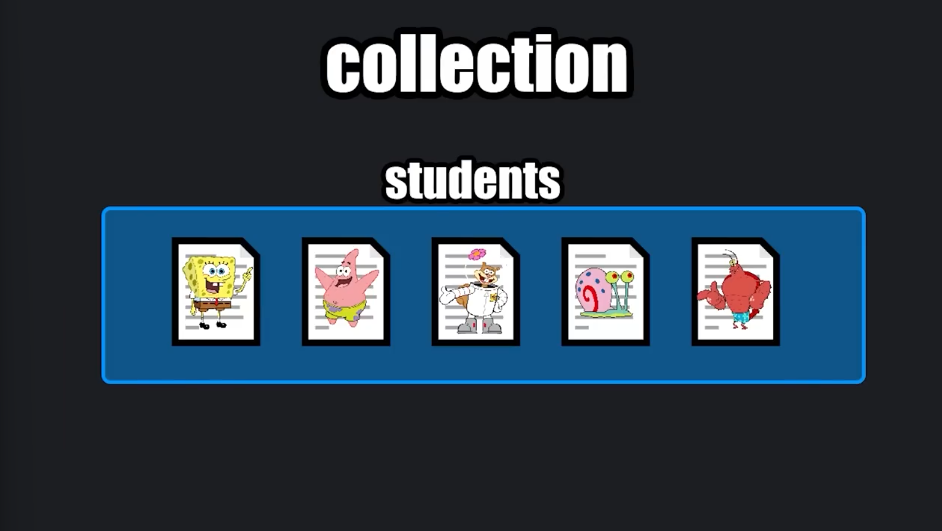

A databse
Is a group of one or more collections
   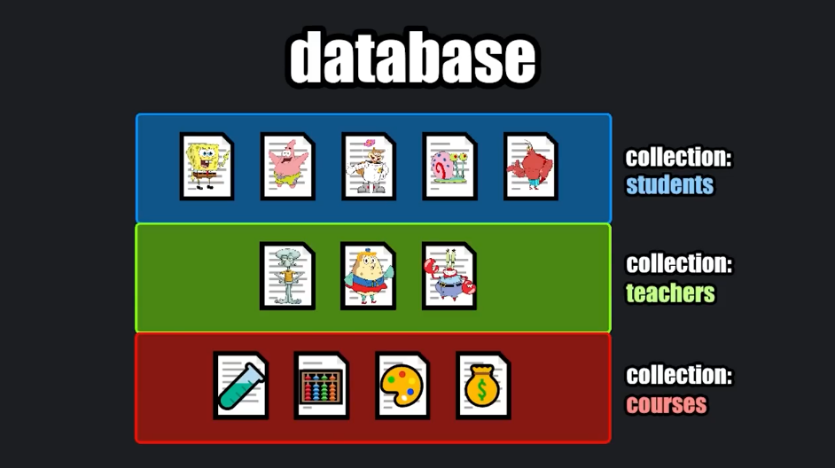

This makes working with and scaling our databse easy

Basic commands to get started
Establish the connection by initiating the MongoDB shell using the `mongsh` command
Type `cls` to clear the screen
Type `exit` to exit out of the MongoDB shell

Create and use databases in MongoDB
Type `show dbs` to show all database, this will give you the list of all current databases

Type `use <select database name if exist>` to use an existing database
Type `use <new database name>` to create a new database
`use school`

After creating a new database it doesn't show immeditately when showing a list of database until you add a collection to it

To create a collection to our databasewe use the createCollection method
It ends with a parenthes just like a function in typical programming languages
`db.createCollection()`
Within a set of parenthesis we pass in an argument for a name for the collection wrapped in double quotes or single quotes depending on your preference
`db.createCollection("students")`

To drop a current database we use `db.dropDatabase()` method
   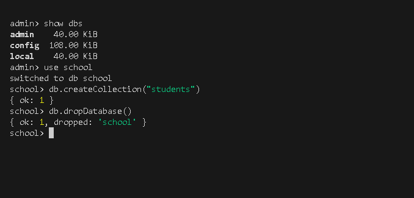


How to insert documents into a MongoDB database
Switch of to the database that you want to use `use school `

Using the insertOne() method

Type `db.<the name of the collection if it's found within the database/ if it doesn't exis one will be created for you>.insertOne().
`db.students.insertOne()`

Within the set of parenthes we place a document which is enclosed within a set of currly braces 

Within  the set of currly braces we can list as many field-value pairs as we would like

Each field-value pair is comma separated
`db.students.insertOne({name:Spongebob", age:30, gpa:3.2})`

To return all documents we use the find method
`db.students.find()`
   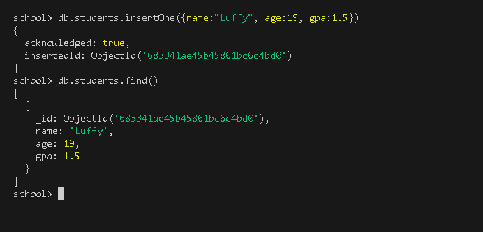

You can insert more than one document at a time by using the insertMany() function

place all documents to be inserted within an array by adding a set of square brakets

Within a set of square brackets add a set of currly braces all comma separates and within each set of currly braces list all of the different field value pairs
`db.students.insertMany([{}, {}, {}])
The array contains several documents
Each document is enclosed with a set of currly brackets
Within each document you can have as many field-value pairs as you like, they all don't need to be consistent
   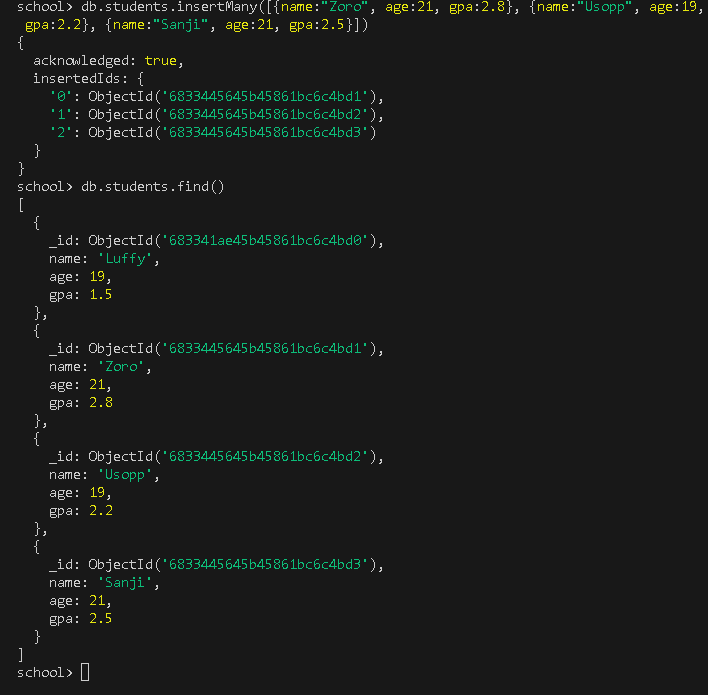

Basic data types in MongoDB
1. A string 
- Is a series of text within quotes (double/single)
- They can contain spaces i.e Monkey D Luffy
- They can contain number i.e Brook99 .numbers a treated differently, we read them more as characters rather than actual numbers

2. Intergers
- An interger is a whole number.

3. Doubles
- A double is a number that contain decimal portions

4. Booleans
- Are either true or false
- Kind of like a light switch, it's only on or off, there's only two states 

5. Date objects
To create a date object you can use the `new` keyword followed by a call to the date constructor
If you don't pass any arguments to the date constructor, you'll use the current time in the UTC time-zone, otherwise you pass a date in time and you could add the time as well

6. null
- means no value

7. Arrays
- much like in mordern programming languages is kind of like a variable that has more than one value, but in MongoDB we  have a field that can have more than one value

8. Nested documents
- Good for addresses
- To create a nested document you use a set of currly braces,within the nested document we can list some field value pairsCo
   

How to sort and limit documents in MongoDB

To sort documents into some sort of order we type `db.<name of the collection>.find()` then do method chaining, after the find method we add. and call the sort method

The sort()
Takes a document by which field wwould we like to sort
Below shows how to sort names in alphabetical order 1

`db.students.find().sort({name:1})`

   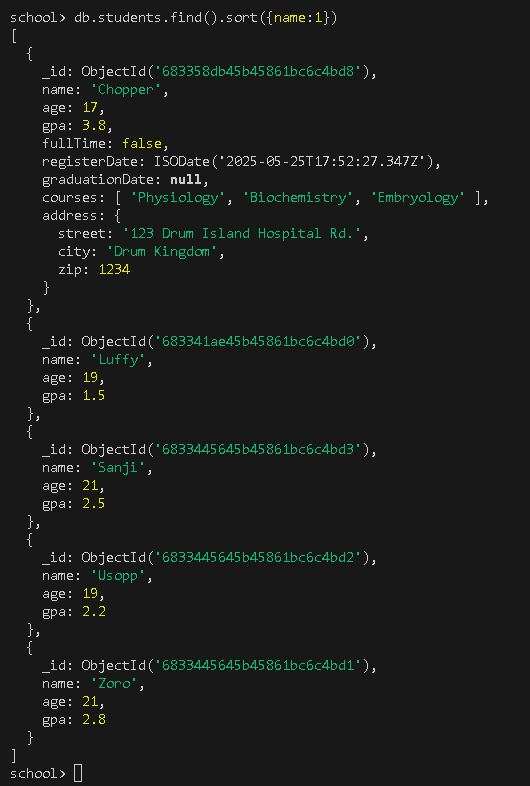

Below shows how to sort names in reverse alphabetical order -1
`db.students.find().sort({name:-1})`

   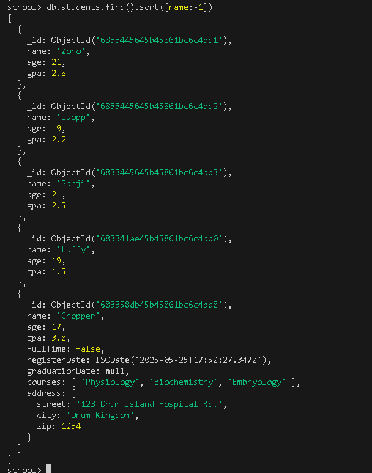

Sort documents by GPA in ascending order
`db.students.find().sort({gpa:1})`

Sort documents by GPA in descending order
`db.students.find().sort({gpa:-1})`


The limit method
Allows us to limit the amount of documents that are returned to us

`db.students.find().limit(here we pass the number of documents we would like returned to us as an argument)`

example passing one document NB// Here documents are sorted by Objectid

`db.students.find().limit(1)`

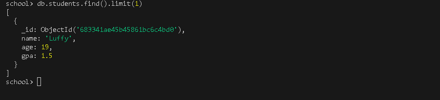

We can combine both the sort and the limit method

Return the students with the highest gpa

`db.students.find().sort({gpa:-1}).limit(1)`

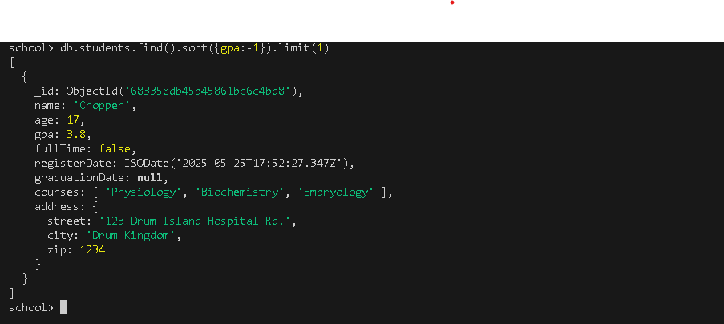

The find method returns all documents in the collection
what to do if you want specific documents?
 we add some arguments to the find method
 `db.students.find({query},{projection})`

 2 parameters that we can send the arguments to

 1st parameter
 when you're trying to limit the results
 the first argument is a document object, the parameter is the query parameter - it specifies selection filters i.e if you need one student, list the criteria

 if you want a student named Zoro

 `db.students.find({name:"Zoro"})`

 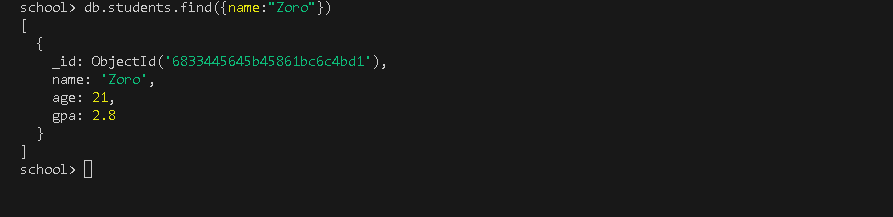

 Find any student with a GPA of 2.5

 `db.students.find({gpa:2.5})`

You can even use more than one filter
- search for any student that has a GPA of 3.8 as well as fullTime being false
- Each filter is comma separated within the document body


`db.students.find({gpa:3.8, fullTime:false})`

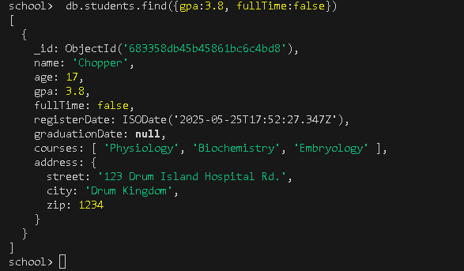

2st parameter
When you're looking for specific fields
To add the projection parameter, pass another document body, their each comma separated

 `db.students.find({query},{projection})`


If you don't specify the query parameter you will return all documents
with the projection parameter you can return specific fields

say for example you don't want all the info availble, just each student name, you can set the field to be true or use 1

Return every document but only give their name

`db.students.find({},{name:true})`

If you also don't want the objectId, just the student names set it to false within the projection parameter

`db.students.find({},{_id:false, name:true})`

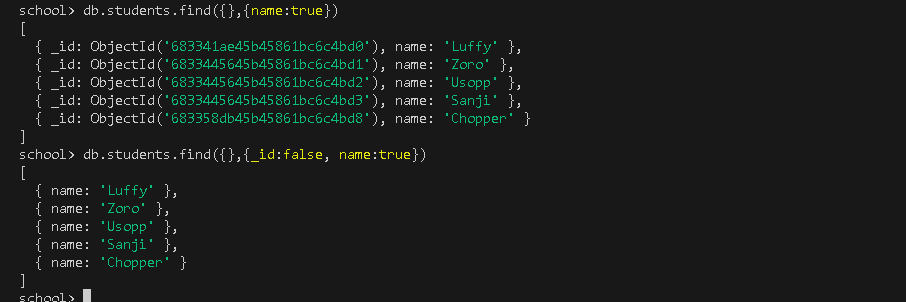

Find every student name as well as their gpa

`db.students.find({},{_id:false, name:true, gpa:true})`

Updating documents in MongoDB
You can either update one document or update many

updateOne method
There are two parameter setups, filter and update
filter is the selection criteria for the update
update what are the modifications that we would like to apply
`db.students.updateOne({filter} {update})`


within a set of curly braces, pass some criteria
Update anybody's name that's Sanji add fullTime field

the second parameter, is another document body (is the update parameter what are the modifications that we would like to apply)
use the set operate which is preseeded with the $
The set operater replaces the value of the field, after the set operator add a colon, then another set of curly braces- that's where we can make changes

you can add or change the value of the field
Sanji doesn't have a fullTime field, if this field already exist we would update it

`db.students.updateOne({name:"Sanji"}, {$set:{fullTime:true}})`

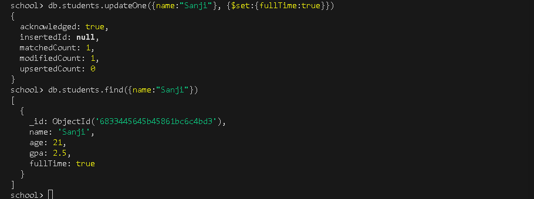

With the filter argument, If working with larger datasets it's possible that more than 2 people can have the same name, it;s safe to update with the objectId because their are unique for each document

Update Luffy using the ObjectId and set fullTime field to be false
 
 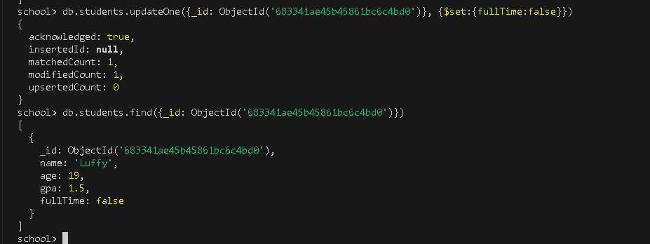

 You can unset the field by using the unset operator
 To remove a field, set the value to be an empty string